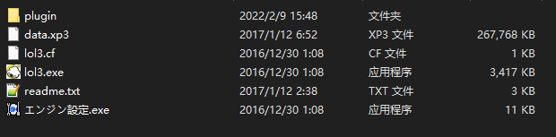
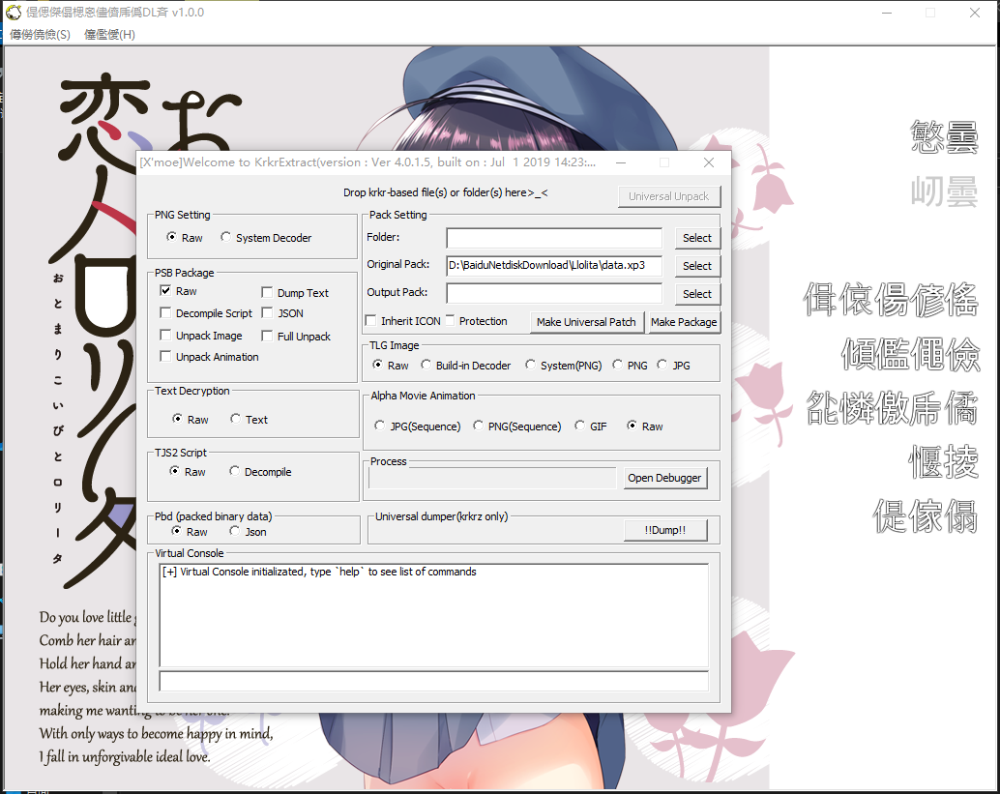
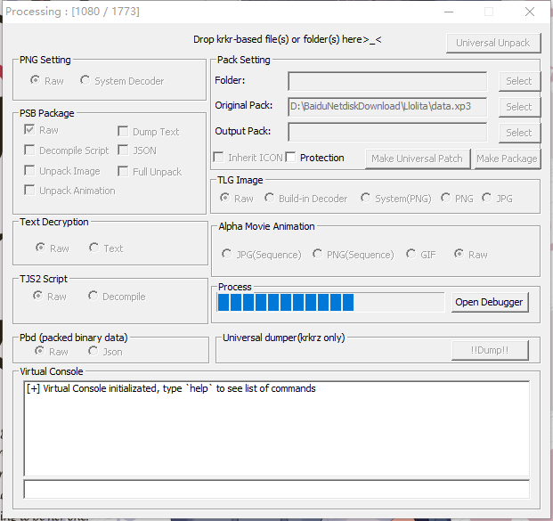
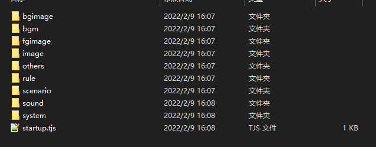

大家好，这次简单的说说krkr引擎的汉化过程。

本教程分为两篇，入门篇，高级篇。希望大家看完后能对krkr的汉化过程有个大概的理解，以及能对krkr建立起自己的分析思路过程。

下面简单说说两个篇章的难度和目的。

__入门篇：了解krkr2/z的汉化流程，能独立完成简单的游戏汉化__。

__高级篇：深化理解krkr2/z的汉化流程，熟悉不同的文件和脚本。学会通过hook的办法简化汉化流程，以及实现自定义封包的文件读取。__

那现在就开始入门篇吧。

入门篇选的样例游戏比较简单。krkr2选择的是『お泊まり恋人ロリータ』，krkrz选的是『俺の姿が、透明に！？不可視の薬と数奇な運命』。

工具我统一放到最后。

# 一、简单的krkr2游戏汉化

观察目录，不难发现lol3.exe就是游戏的主程序，而data,xp3就是游戏的资源包。事实上，krkr的游戏大多数的封包后缀名是xp3（之所以是大多数是因为还有那么一些奇葩后缀名不是xp3）。

## 1. 解包

我们用KrkrExract来解包游戏。将lol3.exe拖到KrkrExtract.exe上面，krkrextract就能把解包代码注入到游戏里面，并弹出GUI。

（我这里用的版本是4.0.1.5，这个版本是我感觉最稳定的一个版本）

弹出这个界面一般都说明注入成功。

解包只需要把data,xp3拖到GUI上面就行，然后他会执行解包。

解包完成后，解包的文件夹就在游戏目录下的KrkrExtract_Output文件夹内。

## 2. 文件分析

解包完成后就有这几个目录，我们一个一个来看。

__bgimage：__一般存放一些背景图片和CG。

__bgm：__存放一些背景音乐。

__fgimage：__存放立绘文件。

__image：__存放系统UI和其他系统图片。

__others：__存放系统杂项文件（如字体，字体定义脚本等）。

__rule：__存放遮罩文件。

__scenario：__存放游戏进行脚本，一般文本就放在这里面。

__sound：__存放音效等音频文件。

__system：__存放系统脚本，控制游戏总体逻辑。

__startup.tjs：__游戏初始脚本，所有的krkr游戏第一个执行的脚本都是它。

我们汉化只需要关注几个：image（系统UI汉化）、scenario（文本汉化）、system（系统汉化）。

### 1）image

